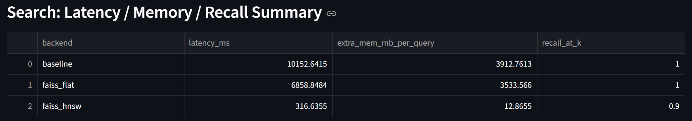
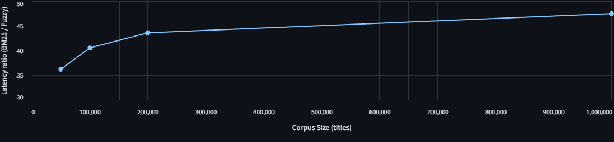

# Performance Benchmarks & Analysis

This document details the benchmarking methodology, results, and engineering trade-offs for the vector retrieval system. We compare **Exact Search (NumPy, FAISS Flat)** against **Approximate Nearest Neighbors (FAISS HNSW)** across varying dataset sizes and system states.

## Benchmark Environment

* **Dataset:** **arxiv_cornell_title_abstract**
  > All experiments are conducted on a corpus derived from the official
  **arXiv metadata snapshot** released by Cornell University
  (`arxiv-metadata-oai-snapshot.json`). A custom preprocessing pipeline was
  implemented to extract titles and abstracts, normalize text fields, and
  export the resulting dataset into a structured CSV format
  (**arxiv_cornell_title_abstract.csv**). 

  >  
  > This abstract-level corpus provides a realistic workload for evaluating
  semantic retrieval systems while isolating retrieval behavior from
  full-text ingestion costs.

* **Embedding Dimension:** 768 (sentence-transformers)

* **Metrics:** End-to-end latency (ms), per-query memory allocation (MB),
  and Recall@k (ground truth: NumPy brute-force full scan).

---
## 1. Scalability: The Memory Wall at Scale

We evaluated retrieval performance on the **full arxiv_cornell_title_abstract
dataset (≈2.9M documents)** to assess scalability.

### Key Observations

1. **Scalability Benefit (~83× Speedup):**
   * **NumPy** requires **~218 ms** per query due to linear \(O(N)\) full-scan.
   * **FAISS HNSW** completes retrieval in **~2.6 ms**, yielding an
     **~83× end-to-end speedup** via sublinear graph traversal.

2. **Memory Stability:**
   * **NumPy** incurs noticeable per-query memory allocations
     (**~11.6 MB**), likely from temporary buffers during computation.
   * **FAISS HNSW** exhibits negligible additional memory usage
     (**~0.004 MB** per query).
   * **Impact:** While both approaches are viable for isolated queries,
     NumPy’s allocation behavior limits throughput under concurrent load,
     whereas HNSW remains memory-stable.

---

## 2. System Stability: Cold Start Latency (Full Dataset)

To simulate a real-world production environment (e.g., stateless workers or
serverless functions), we evaluated **cold-start performance on the full
arxiv_cornell_title_abstract dataset (≈2.9M documents)**. All memory caches were
flushed prior to each query to expose initialization and allocation overheads.

### Key Observations

* **Severe Initialization Overhead in Exact Search:** Under cold-start conditions,
  both NumPy and FAISS Flat exhibit extreme latency spikes due to full-scan
  computation and large temporary memory allocations. NumPy requires
  **~10.15 s**, while FAISS Flat takes **~6.86 s** for a single query on the
  full dataset.

* **System Stability with HNSW (~32× Speedup):** FAISS HNSW minimizes cold-start
  overhead by operating on a pre-built, memory-resident graph structure.
  Cold-start latency is reduced to **~316 ms**, yielding a **~32× system-level
  speedup** over NumPy while using **two orders of magnitude less memory**
  (~12.9 MB vs. >3.5 GB).

* **Memory Footprint as the Dominant Bottleneck:** The large memory allocations
  incurred by exact search approaches make them unsuitable for stateless or
  concurrent serving scenarios. In contrast, HNSW’s bounded memory usage
  enables predictable latency and stable behavior at scale.

**Insight:** While cold-start latency is often overlooked in algorithmic
benchmarks, it becomes a first-order constraint in production ML systems.
Graph-based ANN indices such as HNSW provide not only algorithmic acceleration
but also **system-level stability** under realistic deployment conditions.

---

## 3. Parameter Tuning: Recall vs. Latency Trade-off
We conducted an ablation study on the HNSW `efSearch` parameter to find the optimal configuration for **top_k=20**.

### Data Summary (Top-k = 20)

| efSearch | Latency (ms) | Recall@20 | Note |
| :--- | :--- | :--- | :--- |
| 8 | 2.58 | 0.8695 | *Invalid for target recall (efSearch < k); results affected by warm-up behavior.* |
| 16 | 2.31 | 0.9412 | *Invalid for target recall (efSearch < k); results affected by warm-up behavior.* |
| **32** | **2.75** | **0.9750** | **Baseline (Valid)** |
| **64** | **3.59** | **0.9877** | **High Performance** |
| **128** | **4.86** | **0.9982** | **⭐ Production Choice** |
| 256 | 7.42 | 0.9992 | Diminishing Returns |
| 1024 | 21.49 | 0.9995 | Latency Spike |

### Engineering Insights
1.  **The "Warm-up" Phenomenon:**
    Initial runs with low `efSearch` (8, 16) showed higher or inconsistent latencies due to CPU warm-up and cache filling. Stable performance is observed from `efSearch=32` onwards.
2.  **Production Recommendation (`efSearch=128`):**
    * We selected **`efSearch=128`** as the production setting.
    * **Reasoning:** It achieves **near-perfect recall (99.8%)** while keeping latency **under 5ms**.
    * Compared to `efSearch=32` (2.75ms), the additional ~2ms cost is negligible in a RAG pipeline (where LLM generation takes seconds), but the reliability gain (avoiding missed relevant chunks) is substantial.

---

## 4. Resource Footprint & Capacity Planning (Full Dataset)

Beyond latency, we analyzed the storage and memory footprint of the system to
estimate hardware requirements for production deployment on the full dataset.

| Component | Size (MB) | Description |
| :--- | :--- | :--- |
| **Index (Exact / Flat)** | 4,252.52 | Raw FAISS Flat index (baseline exact-search storage). |
| **Index (HNSW)** | 5,005.97 | Active ANN search index including graph edges. |
| **Embeddings** | 3,992.72 | Zarr-backed dense vector storage. |
| **Metadata** | 3,989.13 | JSONL mappings (titles, abstracts, IDs). |
| **Total Footprint** | **17,240.34** | Total persistent system state. |

### Engineering Insights: Space–Time Trade-off

1. **Moderate Storage Overhead for ANN Indexing (+17.7%):**
   * Migrating from a Flat index to HNSW increases index storage by
     **~753 MB**, corresponding to **~17.7%** additional space relative to
     the exact-search baseline.
   * **Interpretation:** This modest storage overhead enables a
     **~32× system-level speedup** under full-dataset cold-start conditions,
     representing a practical space–time trade-off for production systems.

2. **Capacity Planning Implications:**
   * The total persistent system state occupies approximately **17.2 GB**.
   * **Deployment Strategy:** To guarantee fully in-memory operation and
     avoid disk-induced latency, a production environment should provision
     at least **32 GB of RAM**, leaving headroom for the OS, application
     runtime, and concurrent query processing.
   * **Optimization Path:** In memory-constrained environments, the
     `embeddings.zarr` and `metadata.jsonl` layers can be memory-mapped
     (mmap), keeping only the HNSW index (~5 GB) resident in RAM while
     preserving acceptable performance.

---

## 5. Scalability Analysis: Title-Level Seed Mapping (Fuzzy vs Python BM25)

To support the **seed mapping** feature (users selecting specific papers by title),
we evaluated the trade-off between **hit rate** and **latency** for two sparse
retrieval approaches:

- **Fuzzy string matching** (`RapidFuzz`, normalization + ratio)
- **BM25 ranking** (`rank_bm25`, in-memory Python implementation)

**Objective.** Assess whether a pure Python BM25 implementation can sustain
interactive latency (≈< 100 ms per query) as the title corpus scales from
50K to 1M entries.

### Benchmark Setup

- **Corpus.** Sampled paper titles from the arXiv-derived index.
- **Ground truth.** For each base title, the “correct” document is its original `doc_idx`.
- **Queries.** For each of 200 base titles, we generated several variants
  (whitespace changes, case changes, truncated titles, minor typos), yielding
  ~730–740 query strings per corpus size.

A query is counted as a **hit** if the method returns the correct `doc_idx`
in its candidate list.

### Benchmark Results

| Corpus Size | Method                  | Hit Rate (Seed Variants) | Avg Latency (ms / query) |
| :---------: | :---------------------- | :----------------------: | :----------------------: |
| 50K         | Fuzzy (RapidFuzz)       | 94.45%                   | **1.53**                 |
|             | BM25 (`rank_bm25`)      | **100.00%**              | 55.56                    |
| 100K        | Fuzzy                   | 95.15%                   | 7.02                     |
|             | BM25                    | **99.87%**               | 284.43                   |
| 200K        | Fuzzy                   | 94.57%                   | 15.12                    |
|             | BM25                    | **100.00%**              | 658.82                   |
| 1M          | Fuzzy                   | 95.08%                   | 75.92                    |
|             | BM25                    | **100.00%**              | **3,601.51**             |

### Engineering Insights

1. **Accuracy vs robustness**

   - Across all corpus sizes, **BM25 (`rank_bm25`)** achieved an almost perfect
     hit rate on the perturbed title set (99.87–100%). For known-item search
     (users trying to find a specific paper), BM25 behaves very reliably.
   - **Fuzzy matching** (normalization + RapidFuzz) consistently reached around
     **95%** hit rate. In our test, the remaining ~5% correspond to more aggressive
     perturbations (heavy truncation, severe typos). For interactive seed mapping
     with only a few titles per request, this accuracy is often acceptable in practice.

2. **Scalability limits of Python BM25**

   - At **50K** titles, Python-based BM25 via `rank_bm25` averaged about
     **55 ms/query**, which is marginally acceptable for lightweight backend tasks.
   - As the corpus grows to **100K / 200K / 1M**, latency increases roughly linearly:

     - 100K: **284 ms**
     - 200K: **659 ms**
     - 1M : **3,601 ms** (≈3.6 seconds)

   - This shows that a Python list–based BM25 implementation with full-corpus
     scanning is not suitable for interactive online queries at 10^5–10^6 scale.

3. **Relative efficiency: Fuzzy vs Python BM25**
   - At 1M titles, fuzzy matching averages **~76 ms** per query, whereas BM25
     averages **~3.6 seconds**—roughly a **50× slowdown** for only a modest
     accuracy gain (from ≈95% to ≈100%).
   - In typical seed-mapping scenarios (3–10 titles per request), fuzzy’s latency
     is entirely acceptable. In contrast, placing Python BM25 on the critical path
     would dominate end-to-end latency and degrade user experience.

     Figure 5 shows the latency ratio (BM25 / Fuzzy) as the title corpus grows:
    - At 50K titles, BM25 is already ~36× slower than Fuzzy.
    - At 100K–200K titles, the ratio increases to ~40–44×.
    - At 1M titles, BM25 is nearly **47×** slower (≈3.6 s vs 76 ms).

### Design Decision

- For the **seed mapping** use case (users selecting or entering a small number of
  preferred papers):

  - We adopt **normalization + fuzzy matching (RapidFuzz)** as the default online
    resolver, achieving **≈95% hit rate with low latency** and good scalability.
  - BM25 (`rank_bm25`) is retained as an **offline analysis tool**, used to
    illustrate the theoretical upper bound of lexical ranking and to inform
    future decisions about integrating a dedicated search engine.

- For future support of **high-precision, low-latency lexical retrieval** or
  stage-1 candidate generation over a **1M+ corpus**:

  - We do **not** plan to use `rank_bm25` as an online engine. Instead, we would
    adopt a proper inverted index–based search engine (e.g., **Tantivy** or
    **Lucene/Elasticsearch**) to avoid per-query O(N) scans.
  - In that architecture, BM25 would serve as the **first-stage candidate retriever**,
    and the existing FAISS HNSW/Flat vector indices would remain responsible for
    second-stage reranking and RAG context selection.

---

## 6. Appendix: Note on Exact Search (NumPy vs. FAISS Flat)

Benchmarks show that **NumPy (~218 ms)** outperforms **FAISS Flat (~1.2 s)** for
CPU-based exact search on this dataset.

* **Analysis:** NumPy benefits from highly optimized BLAS/MKL vectorization for
  dense matrix operations, whereas FAISS Flat introduces additional abstraction
  overhead in CPU-only settings.
* **Conclusion:** Despite this advantage, exact search scales linearly and
  becomes impractical at production scale. Transitioning to **HNSW-based
  approximate search** provides the necessary order-of-magnitude improvements
  in latency and memory stability for large-scale retrieval systems.
