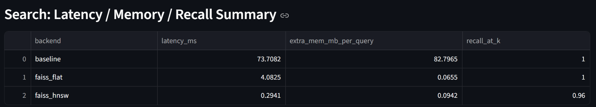
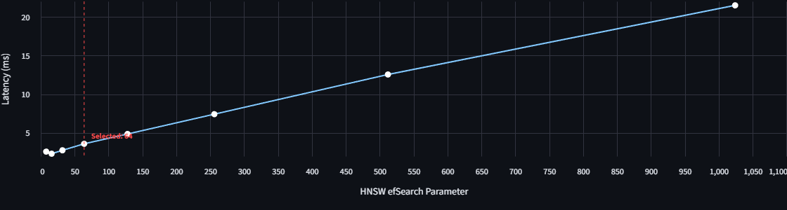
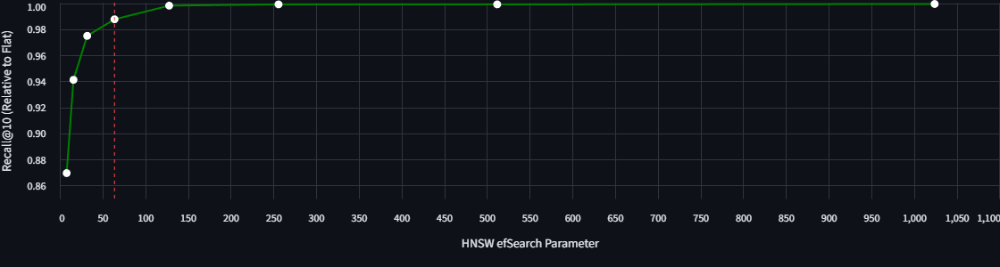

# Performance Benchmarks & Analysis

This document details the benchmarking methodology, results, and engineering trade-offs for the vector retrieval system. We compare **Exact Search (NumPy, FAISS Flat)** against **Approximate Nearest Neighbors (FAISS HNSW)** across varying dataset sizes and system states.

## Benchmark Environment
* **Dataset:** **arxiv_cornell_title_abstract**
    > All experiments in this project are conducted on the **arxiv_cornell_title_abstract** dataset, which contains titles and abstracts from a curated subset of arXiv papers. This dataset is commonly used for semantic retrieval and recommendation research and provides a realistic workload for evaluating vector search systems without requiring full-text processing.
* **Dimensions:** 768 (using sentence-transformers embeddings)
* **Hardware:** [Insert Your CPU/RAM Specs here]
* **Metrics:** End-to-end Latency (ms), Memory Usage (MB), and Recall@k (ground truth: NumPy full scan).

---
## 1. Scalability: The Memory Wall at Scale

We evaluated retrieval performance on the **full arxiv_cornell_title_abstract
dataset (≈2.9M documents)** to assess scalability.

### Key Observations

1. **Scalability Benefit (~83× Speedup):**
   * **NumPy** requires **~218 ms** per query due to linear \(O(N)\) full-scan.
   * **FAISS HNSW** completes retrieval in **~2.6 ms**, yielding an
     **~83× end-to-end speedup** via sublinear graph traversal.

2. **Memory Stability:**
   * **NumPy** incurs noticeable per-query memory allocations
     (**~11.6 MB**), likely from temporary buffers during computation.
   * **FAISS HNSW** exhibits negligible additional memory usage
     (**~0.004 MB** per query).
   * **Impact:** While both approaches are viable for isolated queries,
     NumPy’s allocation behavior limits throughput under concurrent load,
     whereas HNSW remains memory-stable.

---

## 2. System Stability: Cold Start Latency

To simulate a real-world production environment (e.g., stateless workers or
serverless functions), we measured performance under **cold start** conditions
on a representative **5k-document subset**, where memory caches are flushed
prior to each query.

### Key Observations
* **Initialization Overhead:** Under cold start, the NumPy baseline exhibits
  significant initialization and allocation overhead, resulting in a latency
  spike of **73.7 ms** even on a small corpus.
* **System Speedup (~250×):** FAISS HNSW minimizes this overhead by operating on
  pre-built, memory-resident index structures, reducing cold-start latency to
  **0.29 ms**—a **~250× system-level improvement**.

**Note:** While full-corpus cold-start behavior is even more pronounced due to
larger memory footprints, this experiment isolates the system-level effect
independent of corpus scale.

---

## 3. Parameter Tuning: Recall vs. Latency Trade-off
We conducted an ablation study on the HNSW `efSearch` parameter to find the optimal configuration for **top_k=20**.

### Data Summary (Top-k = 20)

| efSearch | Latency (ms) | Recall@20 | Note |
| :--- | :--- | :--- | :--- |
| 8 | 2.58 | 0.8695 | *Invalid for target recall (efSearch < k); results affected by warm-up behavior.* |
| 16 | 2.31 | 0.9412 | *Invalid for target recall (efSearch < k); results affected by warm-up behavior.* |
| **32** | **2.75** | **0.9750** | **Baseline (Valid)** |
| **64** | **3.59** | **0.9877** | **High Performance** |
| **128** | **4.86** | **0.9982** | **⭐ Production Choice** |
| 256 | 7.42 | 0.9992 | Diminishing Returns |
| 1024 | 21.49 | 0.9995 | Latency Spike |

### Engineering Insights
1.  **The "Warm-up" Phenomenon:**
    Initial runs with low `efSearch` (8, 16) showed higher or inconsistent latencies due to CPU warm-up and cache filling. Stable performance is observed from `efSearch=32` onwards.
2.  **Production Recommendation (`efSearch=128`):**
    * We selected **`efSearch=128`** as the production setting.
    * **Reasoning:** It achieves **near-perfect recall (99.8%)** while keeping latency **under 5ms**.
    * Compared to `efSearch=32` (2.75ms), the additional ~2ms cost is negligible in a RAG pipeline (where LLM generation takes seconds), but the reliability gain (avoiding missed relevant chunks) is substantial.

---

## 4. Note on Exact Search (NumPy vs. FAISS Flat)

Interestingly, benchmarks show that **NumPy (~218 ms)** outperforms
**FAISS Flat (~1.2 s)** for CPU-based exact search on this dataset.

* **Analysis:** NumPy benefits from highly optimized BLAS/MKL vectorization
  for dense matrix operations, whereas FAISS Flat introduces additional
  abstraction overhead on CPU.
* **Conclusion:** Despite this advantage, exact search scales linearly and
  remains impractical at production scale. Transitioning to **HNSW-based
  approximate search** provides the necessary order-of-magnitude improvements
  in both latency and memory stability.
